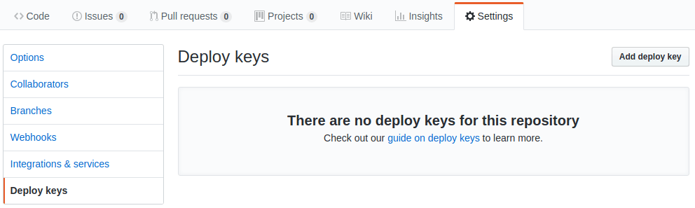
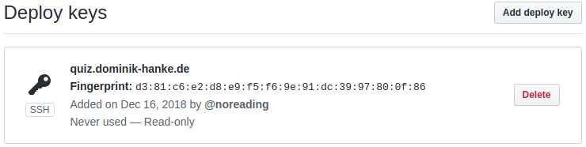

# Add an application: HTML, CSS & JavaScript

## Create a SSH key for the application

The following commands create a new SSH key. We use the name of the Github repository in the name of the key file, so that it is easier to remember which key file was created for which Github project.

This will, of course, work in a similar way for Gitlab or Bitbucket.

<pre>
cd ~/.ssh
ssh-keygen -t rsa -b 4096 -f "github_{repository name}" -q -N "" -C "{username}@{application subdomain}{your domain}"
</pre>

Example:

<pre>
ssh-keygen -t rsa -b 4096 -f github_react-quiz -q -N "" -C "dominik@quiz.dominik-hanke.de"
</pre>

## Add the new key as Deploy key to the Github repository

We will add the generated key as "Deploy key" to github, with read-only access, to reduce unnecessary security risks. Go to your github project page, choose the tab "Settings" and click on "Deploy keys" in the sidebar on the left.

Click on the button "Add deploy key" on the top-right and paste your deployment key into the form. To read the key and copy it, you can use the `cat` command.

<pre>
cat ~/.ssh/github_{repository name}.pub
</pre>

The deploy key form:

The new key will be shown as never used one in the list.

## Create / update SSH config

If you don't have an SSH config file yet, we need to create that, as it is used to handle multiple SSH keys for different Github repositories. Create the config file with the following command:

<pre>
touch ~/.ssh/config && chmod 600 ~/.ssh/config
</pre>

Open the config file using nano:

<pre>
nano ~/.ssh/config
</pre>

Add a new configuration block for the application:

<pre>
# {application subdomain}{your domain}
Host {repository name} github.com
Hostname github.com
IdentityFile /home/{username}/.ssh/github_{repository name}
</pre>

Example:

<pre>
# quiz.dominik-hanke.de
Host react-quiz github.com
Hostname github.com
IdentityFile /home/dominik/.ssh/github_react-quiz
</pre>

## Clone the repository on your server

Let's clone the repository into a new directory named by the domain of the application. We use the SSH config to connect to the repository using the matching SSH key.

<pre>
git clone git@{repository name}:{github username}/{repository-name}.git /var/www/html/{application subdomain}{your domain}
</pre>

Example:

<pre>
git clone git@react-quiz:noreading/react-quiz.git /var/www/html/quiz.dominik-hanke.de
</pre>

## Install needed packages &amp; run build commands

Run the package installation, if your application uses npm or yarn:

<pre>
cd /var/www/html/<b>{application domain}</b>  
npm install
</pre>

If your application has additional build / setup scripts, run them now. And if you have to set environment variables, this is again the right time to do that.

## Add a new nginx host

Copy the template from the starter files:

<pre>
sudo cp ~/simple-node-server/starter-files/nginx/application-html-css-js.conf /etc/nginx/conf.d/<b>{application domain}</b>.conf
</pre>

Example:

<pre>
sudo cp ~/simple-node-server/starter-files/nginx/application-html-css-js.conf /etc/nginx/conf.d/quiz.dominik-hanke.de.conf
</pre>

Open the new configuration with <a href="https://github.com/noreading/simple-node-server#basic-nano-commands" target="_blank">nano</a>:

<pre>
sudo nano /etc/nginx/conf.d/<b>{application domain}</b>.conf
</pre>

Update the config file and replace **all** the placeholders for the application domain, but **do not** remove the #hashes in front of the 3 SSL lines for now.

Check if the configuration is working:

<pre>
sudo service nginx configtest
</pre>

The result should look like this:

<pre>
nginx: the configuration file /etc/nginx/nginx.conf syntax is ok
nginx: configuration file /etc/nginx/nginx.conf test is successful
</pre>

If it doesn't, please check if you missed a semicolon or broke something during copy &amp; paste.

When everything is fine, restart the nginx server:

<pre>
sudo service nginx restart
</pre>

## Generate a Let's Encrypt certificate

Now, that we've prepared the nginx configuration, we're able to request a new certificate for our application domain:

<pre>
sudo certbot certonly --webroot --agree-tos --no-eff-email --email <b>{your email}</b> -w /var/www/letsencrypt -d <b>{application domain}</b>
</pre>

The result should look like this:

<pre>
Saving debug log to /var/log/letsencrypt/letsencrypt.log
Plugins selected: Authenticator webroot, Installer None
Obtaining a new certificate
Performing the following challenges:
http-01 challenge for quiz.dominik-hanke.de
Using the webroot path /var/www/letsencrypt for all unmatched domains.
Waiting for verification...
Cleaning up challenges

IMPORTANT NOTES:
 - Congratulations! Your certificate and chain have been saved at:
   /etc/letsencrypt/live/quiz.dominik-hanke.de/fullchain.pem
   Your key file has been saved at:
   /etc/letsencrypt/live/quiz.dominik-hanke.de/privkey.pem
   Your cert will expire on 2019-03-16. To obtain a new or tweaked
   version of this certificate in the future, simply run certbot
   again. To non-interactively renew *all* of your certificates, run
   "certbot renew"
 - If you like Certbot, please consider supporting our work by:

   Donating to ISRG / Let's Encrypt:   https://letsencrypt.org/donate
   Donating to EFF:                    https://eff.org/donate-le
</pre>

## Activate the certificate

Open the nginx host configuration with <a href="https://github.com/noreading/simple-node-server#basic-nano-commands" target="_blank">nano</a>:

<pre>
sudo nano /etc/nginx/conf.d/<b>{application domain}</b>.conf
</pre>

Update the following lines and remove the #hashes in front of them:

<pre>
server {
    ...
    ssl_certificate /etc/letsencrypt/live/<b>{application domain}</b>/fullchain.pem;
    ssl_certificate_key /etc/letsencrypt/live/<b>{application domain}</b>/privkey.pem;
    ssl_trusted_certificate /etc/letsencrypt/live/<b>{application domain}</b>/fullchain.pem;
    ...
}
</pre>

Restart the nginx server:

<pre>
sudo service nginx restart
</pre>

## Test the setup

<pre>
https://<b>{application domain}</b>
http://<b>{application domain}</b>
</pre>
