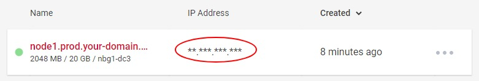

# Adding a new user

## Get the IP address

Copy the IP address of your new server from the server management page, where you created the machine. If you click the IP adress in the overview, it will automatically get copied to your clipboard.

I suggest to paste the address into an empty text file, so that you don't have to go back to the management page again and again.

## Login to your server

The commands of this tutorial can be run in any terminal on Ubuntu or Mac computers. For Windows you need a linux shell like Git Bash (comes together with Git) or [Cygwin](http://www.cygwin.com/).

Use SSH to login:  
<pre>
ssh root@<b>{ip address}</b>
</pre>

## Add a new user

It's common to use your real name as username, so that it's easy to remember. If you want to manage a server with multiple users it can be a benefit to use concatenated names like "dhanke" for "Dominik Hanke" as multiple people could have the same first name.

If you're managing the server alone, the easiest thing to remembe is your first name.

### Create the user and change the password

<pre>
useradd -m -s /bin/bash <b>{username}</b>
passwd <b>{username}</b>
</pre>

### Add sudo access

Open the [sudo](https://www.howtoforge.com/tutorial/sudo-beginners-guide/) configuration in the [nano](https://www.nano-editor.org/) editor:  

<pre>
nano /etc/sudoers
</pre>

Enable sudo access for the new user by adding this line:  
<pre>
# Allow user to execute any command without password prompt
<b>{username}</b> ALL=(ALL) NOPASSWD:ALL
</pre>

### Add your SSH key

Change your terminal session to that user:  
<pre>
su - <b>{username}</b>
</pre>

Create the SSH directory:  
<pre>
mkdir .ssh
chmod 700 .ssh
</pre>

Create an __authorized_keys__ file:  
</pre>
touch .ssh/authorized_keys
chmod 600 .ssh/authorized_keys
</pre>

Add your SSH key to the file:  
<pre>
nano .ssh/authorized_keys
</pre>

Press [Ctrl] + [d] twice, to logout of the server.  
Login with the new user:  
<pre>
ssh <b>{username}</b>@<b>{ip address}</b>
</pre>

## Clone the starter files

Clone this repository into your home folder, to get files that you can edit and / or copy to their destination. This will speed up the configuration in the following steps.

<pre>
cd ~
git clone https://github.com/noreading/simple-node-server.git
</pre>

---
__Next:__ [Adding security](./adding-security.md)