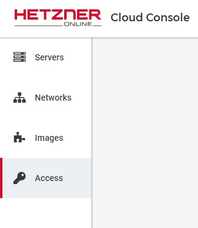

# Adding a project and SSH keys

## Choose a good name

Your project should have a name that tells what kind of a project it is and it should help to group your servers into logical structure.

Some examples:  
- Client Websites
- Open Source
- Development
- Databases
- Private

## Create the project

Go to the project management page in your Hetzner account, click the "Add Project" button, type in your project name and hit [Enter].

- [Project Management](https://console.hetzner.cloud/projects)

## Add your SSH key

To be able to securely login into the new servers you create you should add your SSH keys to the project.  
If you don't connect SSH keys the server will be accessible with a generated password and bots or hackers can try to brute-force your root account.

Go to the SSH Key Management page by using the navigation on the left side, after selecting your new project.

Add your public SSH key of the user and machine you use to connect to your new server.

---
__Next:__ [Creating a small server](./creating-a-small-server.md)