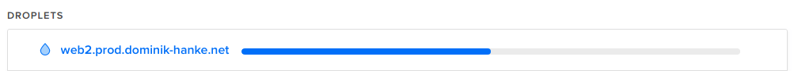

# Create your first droplet

We will setup your first cloud-based server in this step and show you which settings should be chosen as a beginner. Please keep in mind that you can always upgrade your server, if you need it, so don't book a big one right now, just "to be sure".

## Click the button

Go to the [Login page](https://cloud.digitalocean.com/login) and login to your account. In the top-right corner you should see a green button "Create". Click on that button and select "Droplets" from the list.


## Choose an image

Choose "Ubuntu 18.04 x64" as this is a common image to run production servers and the tutorial is based on this version. Some commands or packages may differ in other versions.


## Choose a size

The smallest standard droplet is enough to host multiple Node.js applications if they don't have thousands of requests at the same time. Of course it's also important how much memory the applications consume, but for the first steps 1 GB of RAM should be enough.


## Choose a datacenter region

DigitalOcean offers different locations for their droplets. You should choose a server close to your location, to get fast access and good speed for your users. If most of your users are located in another country, it could be an option to start your machine there.


## Select additional options

I suggest to activate the two (free) additional options "IPv6" and "Monitoring" to get the most out of your machine.


## Add your SSH key

To be able to securely login into the new server that you create you should add your SSH key. If you don't add your SSH key the droplet will be accessible with a generated password and bots or hackers could try to brute-force your root account.


Add your public SSH key. If you don't have an SSH key yet, please read [this page](https://help.github.com/articles/generating-a-new-ssh-key-and-adding-it-to-the-ssh-agent/) and go on afterwards.


## Choose a hostname and project

You should use a name that is self-explanatory and reminds you what the server is used for and if it is running for production, development, staging, etc.

I like to group my servers like this:

<pre>
# Web
web1.prod.my-domain.com
web1.staging.my-domain.com
web2.prod.my-domain.com

# Database
db1.prod.my-domain.com
db1.staging.my-domain.com
</pre>

DigitalOcean will also create a default project for you, that is selected. Projects can be helpful to organize your servers, once you start to have more of them.


## Start the process

Click the big, green "Create" button to start the process of creating the droplet.  
The droplet building process will be shown.



## Set DNS records

You need to set the DNS records for your domain, to match the used hostname and the demo project of this tutorial. To keep it simple we will tell DigitalOcean do manage your DNS settings. If you want to manage your DNS somewhere else, you should have good knowledge about that.

Go to the [Networking](https://cloud.digitalocean.com/networking/domains) admin page and add your domain.


As a next step you need to setup your domain to use the DigitalOcean DNS servers. There's a good [Tutorial](https://www.digitalocean.com/community/tutorials/how-to-point-to-digitalocean-nameservers-from-common-domain-registrars) explaining how to do that for some of the most common providers.

Add needed **A** and **AAA** records choosing "@" as a placeholder for all possible subdomains (so that foo.your-domain.com, bar.your-domain.com, etc. will work automatically). Select your new droplet as "Will direct to" and click on the "Create Record" button.

**A Record (IP v4)**


**AAA Record (IP v6)**


The update of DNS records can take up to 24 (or in worst case 48) hours. It should normally work in an hour or two, but that depends on many things that we can't influence.

This is the reason why we will use the IP address in the next steps that you can replace with the hostname, once it is working. To check if the hostname is targeting your server you can use the `ping` command in a terminal.

```bash
ping your-domain.com
```

---

**Next:** [Add a new user](./add-a-new-user.md)
