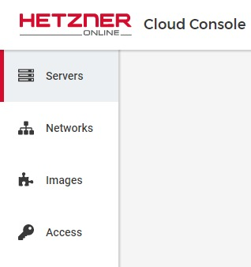
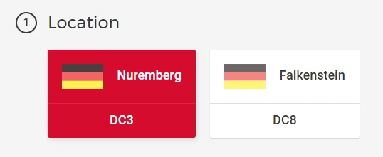
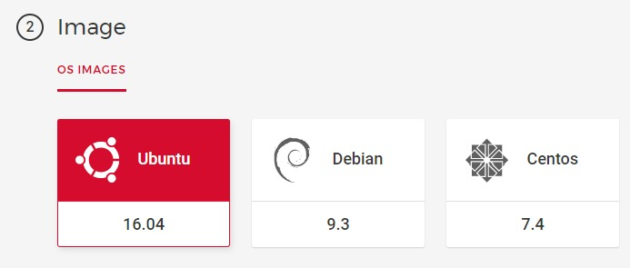
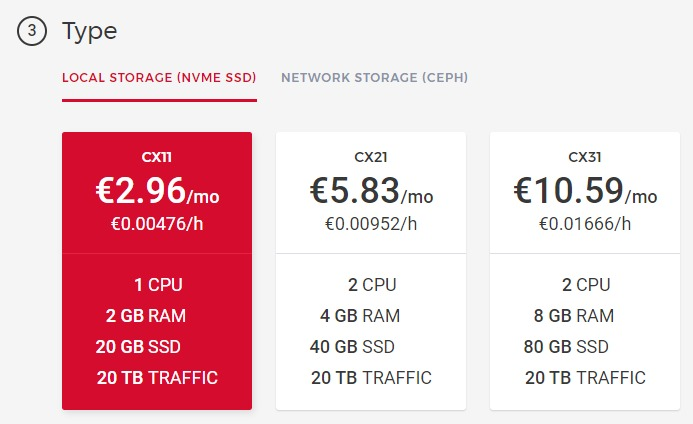
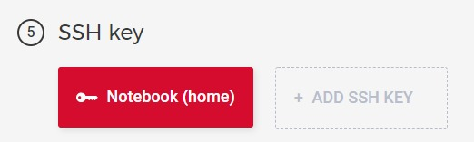

# Creating a small server

## Go to the Server Management page.

Go to the server overview for your project by using the navigation on the left.  
Click the "Add Server" button and follow the next steps.



## Choose a location

Hetzner offers different locations for their cloud servers. As of the date when this tutorial was written, there are only Nuremberg and Falkenstein available.

It doesn't really matter which one you take and I leave this decision up to you.



## Choose an image

Choose "Ubuntu 16.04" as this is a common image for servers and this tutorial is based on it.



## Choose a type

The smallest type for less than 3 € per month is good enough for multiple Node.js projects, depending on their memory usage and traffic.



## Choose additional features

You do'nt need to add user data right now. This is for more advanced server setups where you want to use some kind of auto-configuration based on the data you pass to the server when it's created.

Skip this step for now.

## Choose SSH keys

Select your current SSH key that you added to the project before.

I wouldn't suggest to add all your keys here, because they are added to the __root__ account. We will create a new user in the next step, that you should attach SSH keys to for remote access (from home, work, etc.).



## Choose a name

You should use a name that tells what the server is used for and if it is running for production, development, staging, etc.

__Mixed servers:__  
If a server is used for multiple things, I would not suggest to add all features to the name. You could use the name of the application instead.  
```
portfolio.prod.your-domain.com
```

I group my servers like this:

```
# Node.js
node1.prod.your-domain.com
node1.dev.your-domain.com

# PHP
php1.prod.your-domain.com

# Nginx
web1.prod.your-domain.com
```

## Set DNS records

You need to set the DNS records for your domain, to match the used hostname and the demo project of this tutorial. If you're not managing the DNS settings of your domain by yourself ask your administrator.

Add 2 A records to yout DNS seetings:
```
node1.prod.{your domain}   {server ip address}
boilerplate{your domain}   {server ip address}
```

---
__Next:__ [Adding a new user](./adding-a-new-user.md)