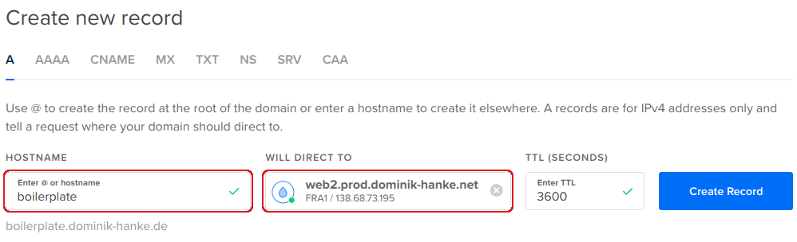

# Install demo project

We will install a demo application using Node.js, Express and MongoDB to test if our setup works as expected.

## Create the subdomain at DigitalOcean

Login ot he [network admin page](https://cloud.digitalocean.com/networking/domains) on DigitalOcean, select your domain and add 2 new entries for the subdomain that we want to use for the boilerplate. Use the "A" and "AAA" entry type and select your droplet from this tutorial as "Will direct to".

## Create a database user

We want to create a user per project database, to limit the access.

Connect to the Mongo shell:

<pre>
sudo mongo
</pre>

Create the new user:

<pre>
use admin
db.auth('databaseManager', '<b>{your db admin password}</b>')

use boilerplate
db.createUser(
  {
    user: "boilerplate",
    pwd: "<b>{create a new password}</b>",
    roles: [ { role: "readWrite", db: "boilerplate" } ]
  }
);

exit;
</pre>

## Clone the repository and install dependencies

We create a web root folder and clone the repository of a demo boilerplate.
I suggest to use a folder /var/www/node/ to store all your node applications.

<pre>
mkdir -p /var/www/node/boilerplate.<b>{your domain}</b>
cd /var/www/node/boilerplate.<b>{your domain}</b>
git clone https://github.com/noreading/express-mongoose-boilerplate.git .
npm install
</pre>

## Configure the application

Copy the sample config file with the cp command. (_Syntax_: `cp source target`) file and edit it with <a href="https://github.com/noreading/simple-node-server#basic-nano-commands" target="_blank">nano</a>:

<pre>
cp .env.sample .env
nano .env
</pre>

Update the config using nano and replace the placeholders:

<pre>
#------------------------------------------------------------------------#
# Environment settings                                                   #
#------------------------------------------------------------------------#

NODE_ENV=production

#------------------------------------------------------------------------#
# Express settings                                                       #
#------------------------------------------------------------------------#

PORT=7000
SESSION_SECRET=Jb^.NC&jRC?sbn>6}R>z
SESSION_KEY=expressjs-bootstrap-boilerplate

#------------------------------------------------------------------------#
# MongoDB settings                                                       #
#------------------------------------------------------------------------#

DATABASE_HOST=localhost
DATABASE_PORT=27017
DATABASE_USERNAME=boilerplate
DATABASE_PASSWORD=<b>{the boilerplate user's password}</b>
DATABASE_NAME=boilerplate
</pre>

## Create the host configuration

Copy the template from the starter files:

<pre>
sudo cp ~/simple-node-server/starter-files/nginx/boilerplate.conf /etc/nginx/conf.d/boilerplate.<b>{your domain}</b>.conf
</pre>

Open the new configuration file with <a href="https://github.com/noreading/simple-node-server#basic-nano-commands" target="_blank">nano</a>:

<pre>
sudo nano /etc/nginx/conf.d/boilerplate.<b>{your domain}</b>.conf
</pre>

Update the following lines and replace the placeholder:

<pre>
server_name boilerplate.<b>{your domain}</b>;

access_log /var/log/nginx/<b>boilerplate.{your domain}</b>-access.log;
error_log /var/log/nginx/<b>boilerplate.{your domain}</b>-error.log;
</pre>

Exit nano pressing `[Ctrl] + [x]` together (<a href="https://github.com/noreading/simple-node-server#basic-nano-commands" target="\_blank">nano reference</a>).

When nano asks if you want to save the modified buffer, enter "y" and press `[Enter]` twice.

Check if the configuration is working:

<pre>
sudo service nginx configtest
</pre>

The result should look like this:

<pre>
nginx: the configuration file /etc/nginx/nginx.conf syntax is ok
nginx: configuration file /etc/nginx/nginx.conf test is successful
</pre>

If it doesn't, please check if you missed a semicolon or broke something during copy &amp; paste.

When everything is fine, restart the nginx server:

<pre>
sudo service nginx restart
</pre>

## Test the setup

To test our setup, we will run the the demo application manually.

<pre>
cd /var/www/node/boilerplate.{your domain}
node start.js
</pre>

If everything works well and there are no errors in your configurations you should be able to access the application in your browser:

<pre>
http://boilerplate.<b>{your domain}</b>
</pre>

Now, that we've seen that everything works, we'll stop the application by pressing `[Ctrl] + [c]` in the terminal to cancel the Node.js process.

We'll learn how to setup our application as a system service in the next step.

---

**Next:** [Install a system service](./install-a-system-service.md)
